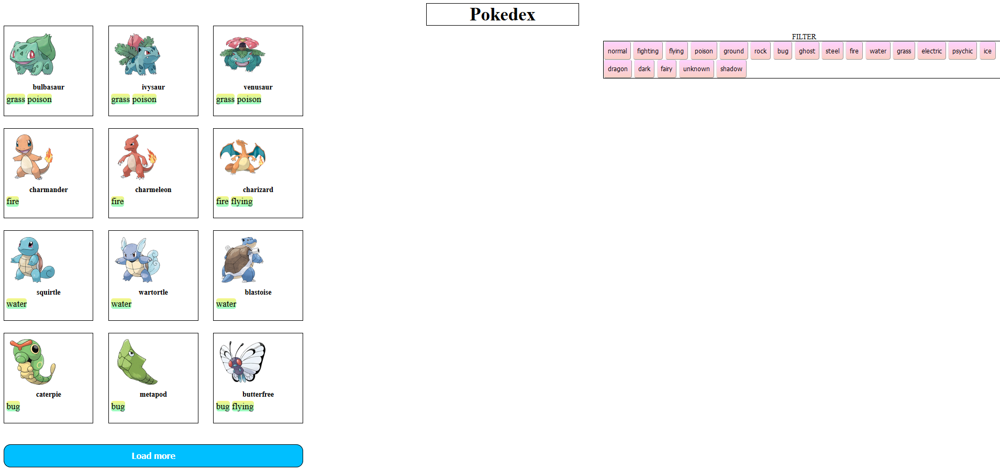
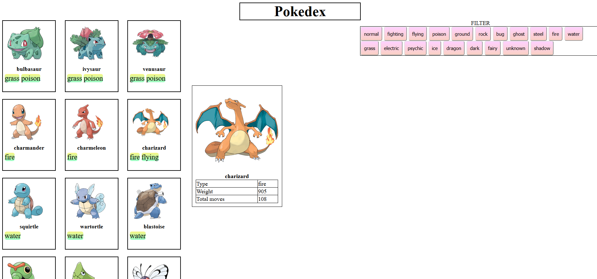

# Pokedex
Pokedex designed to catalogue and provide information regarding the various species of Pokémon featured in the Pokémon video game, anime and manga series.
This project was generated with [Angular CLI](https://github.com/angular/angular-cli) version 11.2.0.

 ## Table of contents
* [General info](#general-info)
* [Technologies](#technologies)
* [Screenshots](#screenshots)
* [Setup](#setup)
* [Features](#features)
* [Status](#status)
* [Contact](#contact)

## General info
With the help of this site you can see a list of Pokémons. When you click on a Pokémon, full information about it is displayed. With the Load More button, you can load even more Pokémons. Also, to speed up the search for the Pokemon you need, use the buttons on the right side of the screen to filter the Pokemons by type
## Technologies
  - AngularJS 1.6 / Angular 2+/4/5/6
  - JavaScript
## Screenshots

Pokemon Charizard is chosen


## Setup

You can open this project in any environment that supports JavaScript, HTML, CSS ... For example: Webstorm, IntelijIdea.
To work with Angular, you need to install a Node.js server and npm package manager if they are not present on the production machine.
We will be using the Angular CLI to compile the application. Angular CLI makes it easy to create an application, compile it.
To install Angular CLI, open the console / command line and execute the following command in it:

```sh
$ npm install -g @angular/cli
```

in order to open a project in a browser, you need to write the following command:

```sh
$ ng s -o
```
#### Development server

Run `ng serve` for a dev server. Navigate to `http://localhost:4200/`. The app will automatically reload if you change any of the source files.

#### Code scaffolding

Run `ng generate component component-name` to generate a new component. You can also use `ng generate directive|pipe|service|class|guard|interface|enum|module`.

#### Build

 `ng build` to build the project. The build artifacts will be stored in the `dist/` directory. Use the `--prod` flag for a production build.

#### Running unit tests

Run `ng test` to execute the unit tests via [Karma](https://karma-runner.github.io).

#### Running end-to-end tests

Run `ng e2e` to execute the end-to-end tests via [Protractor](http://www.protractortest.org/).

#### Further help

To get more help on the Angular CLI use `ng help` or go check out the [Angular CLI Overview and Command Reference](https://angular.io/cli) page.

## Features
List of features ready and TODOs for future development
* Filter visible pokemons by type
* Output full information about the Pokemon when you click on it

To-do list:
* Adaptive styling
## Status
Project is finished
## Contact
Created by [@DianaMakovetska](https://github.com/DianaMakovetskaya) - feel free to contact me


